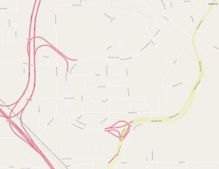
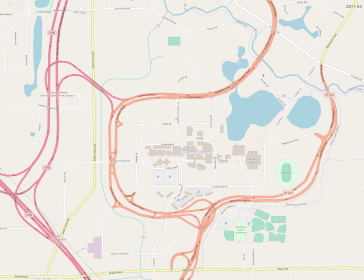
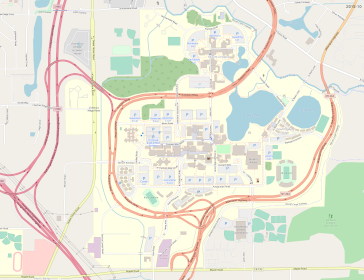

# OSM History Renderer toolbox Docker Build

[](img/ubnorth-2008-09.png)
[](img/ubnorth-2011-04.png)
[](img/ubnorth-2015-10.png)
[](img/ubnorth-2021-01.png)


## Introduction

This work in progress is a toolbox for looking back at how a given section of [OpenStreetMap](https://www.openstreetmap.org/) has changed over time, and rendering images or videos of that history.

It solves the problem of collecting and compiling the various tools and utilities involved.
Right now there are a lot of rough edges and manual steps, but it provides everything you need.
When time allows, more scripts and a friendlier interface can be added.

Currently, running this image just runs a bash shell inside it.
To work with OSM's large data files, you'll want to run it with a bind mount to `/datasets` .


## General Process

- Decide which area you want to render history for, using the [OpenStreetMap](https://www.openstreetmap.org/) website
- Download history file for that area's surrounding region from the "internal" area of https://osm-internal.download.geofabrik.de/
- Extract the history of the smaller area you want to render, or its surrounding metropolitan area
- Import that smaller history file into a PostGIS database
- Render the area at a single date
- Or, render a timespan of image "frames" and make them a video with a program like ffmpeg

For more details see [Processing.md](Processing.md).


## About the image and software

Stage 1 of this image builds the importer and renderer. Stage 2 adds them to overv's tile server docker image [overv/openstreetmap-tile-server](https://hub.docker.com/r/overv/openstreetmap-tile-server/) ([github](https://github.com/Overv/openstreetmap-tile-server)).

For consistency, both stages are built from ubuntu 18.04.

The OSM history renderer itself is only semi-maintained, and can be found at
https://github.com/joto/osm-history-renderer


## Open Source project, licensed under Apache 2.0

This is an open source project.
This Dockerfile and docs are licensed under the Apache License 2.0.

Copyright (C) 2021 Jeremy D Monin

```
Licensed under the Apache License, Version 2.0 (the "License");
you may not use this file except in compliance with the License.
You may obtain a copy of the License at

    http://www.apache.org/licenses/LICENSE-2.0

Unless required by applicable law or agreed to in writing, software
distributed under the License is distributed on an "AS IS" BASIS,
WITHOUT WARRANTIES OR CONDITIONS OF ANY KIND, either express or implied.
See the License for the specific language governing permissions and
limitations under the License.
```

